# 自动登录器 — 系统架构

> 最后更新：2026-06-11

## 架构概述

系统采用 **三层架构**，共 **8 个模块**（5 页面模块 + 2 核心服务模块 + 1 数据模块）。

```mermaid
graph TD
    subgraph UI Layer - QML 页面模块
        HP[home_page<br/>首页]
        LP[login_page<br/>登录配置]
        LM[loginManager_page<br/>站点管理]
        NP[network_page<br/>网卡扫描]
        SP[setting_page<br/>系统设置]
    end

    subgraph Business Layer - C++ 核心服务
        LE[login_engine<br/>登录引擎]
        NS[network_service<br/>网络服务]
    end

    subgraph Data Layer - 数据持久化
        DS[Datas<br/>数据中心]
    end

    HP -->|读取展示| DS
    LP -->|写入配置| DS
    LP -->|调用| LE
    LM -->|读写站点| DS
    LM -->|触发登录| LE
    NP -->|读取网卡| DS
    NP -->|调用扫描| NS
    SP -->|读写设置| DS
    LE -->|读写状态| DS
    LE -->|绑定IP发请求| NS
    NS -->|写入网卡/状态| DS
```



## 三层职责

### UI 层（页面模块）
- 只负责 **展示数据** 和 **响应用户交互**
- 不包含业务逻辑，通过调用核心服务模块执行业务操作
- 技术栈：QML

### 业务层（核心服务模块）
- 封装可复用的 **核心业务逻辑**
- 不依赖 UI，可被多个页面模块调用
- 技术栈：C++

### 数据层（Datas）
- 所有模块的 **共享数据层**
- 提供统一的数据读写接口
- 负责数据持久化（SQLite + JSON）
- 技术栈：C++ + Qt LocalStorage / SQLite

## 模块清单

| 编号 | 模块名 | 类型 | 对应 UI | 职责 |
|------|--------|------|---------|------|
| 1 | home_page | 页面 | UI/首页.qml | 仪表盘概览：网络状态、登录状态、快捷操作 |
| 2 | login_page | 页面 | UI/API_1.qml, UI/Webview_1.qml | 登录配置：API 参数配置 / WebView 流程录制 |
| 3 | loginManager_page | 页面 | UI/站点管理.qml | 站点管理：CRUD、批量操作、手动登录 |
| 4 | network_page | 页面 | UI/网卡扫描.qml | 网卡扫描：网卡列表、状态监控 |
| 5 | setting_page | 页面 | UI/系统设置页.qml | 系统设置：自启、主题、语言、目录 |
| 6 | login_engine | 核心服务 | 无 | 登录引擎：执行 API/WebView 登录、自动登录调度 |
| 7 | network_service | 核心服务 | 无 | 网络服务：网卡扫描、状态监控、IP 绑定请求 |
| 8 | Datas | 数据 | 无 | 数据中心：统一数据读写、持久化、变化通知 |

## 模块依赖矩阵

| 模块 ↓ \ 依赖 → | Datas | login_engine | network_service |
|------------------|-------|-------------|-----------------|
| home_page        | 读    | 调用        | —               |
| login_page       | 读写  | 调用测试    | —               |
| loginManager_page| 读写  | 调用登录    | —               |
| network_page     | 读    | —           | 调用扫描        |
| setting_page     | 读写  | —           | —               |
| login_engine     | 读写  | —           | 调用            |
| network_service  | 写    | —           | —               |
| Datas            | —     | —           | —               |

## 目录结构

```
AutoLogin/
├── CMakeLists.txt
├── main.cpp
├── Main.qml
├── readme.md
├── docs/
│   ├── architecture.md
│   ├── 设计.md
│   ├── module/
│   │   ├── Datas/模块文档.md
│   │   ├── home_page/模块文档.md
│   │   ├── login_page/模块文档.md
│   │   ├── loginManager_page/模块文档.md
│   │   ├── network_page/模块文档.md
│   │   ├── setting_page/模块文档.md
│   │   ├── login_engine/模块文档.md
│   │   └── network_service/模块文档.md
│   └── UI/
├── include/
│   ├── Datas/
│   ├── home_page/
│   ├── login_page/
│   ├── loginManager_page/
│   ├── network_page/
│   ├── setting_page/
│   ├── login_engine/
│   └── network_service/
├── src/
│   ├── Datas/
│   ├── home_page/
│   ├── login_page/
│   ├── loginManager_page/
│   ├── network_page/
│   ├── setting_page/
│   ├── login_engine/
│   └── network_service/
└── UI/
    ├── API_1.qml
    ├── Webview_1.qml
    ├── 站点管理.qml
    ├── 系统设置页.qml
    ├── 网卡扫描.qml
    └── 首页.qml
```

## 设计原则

1. **单向数据流**：页面模块 → 核心服务 → Datas，避免循环依赖
2. **职责单一**：每个模块只负责一个明确的职责领域
3. **接口隔离**：模块间通过明确定义的接口交互，不直接访问内部实现
4. **可测试性**：核心服务模块不依赖 UI，可独立进行单元测试
5. **跨平台**：平台相关代码封装在 network_service 中，其他模块保持平台无关
