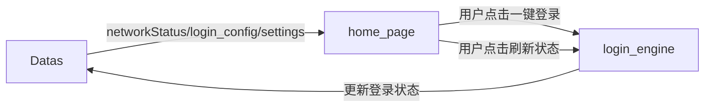

# home_page — 首页模块

> 模块类型：页面模块  
> 对应 UI：`UI/首页.qml`  
> 依赖：Datas（读）、login_engine（调用）  
> 目录：`include/home_page/`、`src/home_page/`

---

## 职责

作为应用的 **仪表盘首页**，展示系统状态概览、站点登录状态汇总、提供快捷操作入口。

---

## 功能列表

### 1. 状态概览面板
- 显示当前网络连接状态（已连接 ✅ / 未连接 ❌），从 Datas 读取 `networkStatus`
- 显示主要出口 IP 地址
- 显示网络最后检测时间

### 2. 站点统计卡片
- 已配置站点总数
- 已启用站点数
- 已登录站点数 / 未登录站点数
- 数据从 Datas 的 login_config 列表聚合计算

### 3. 站点状态列表
- 列表展示所有站点的登录状态摘要
- 每行显示：站点名称、类型（API / WebView）、状态（已登录/未登录）、绑定网卡、最后更新时间
- 支持点击某站点快速跳转到 loginManager_page 查看详情

### 4. 快捷操作区
- **「一键全部登录」** 按钮：调用 `login_engine.executeAll()` 对所有已启用站点执行登录
- **「刷新状态」** 按钮：调用 `login_engine.checkStatus()` 检测所有站点登录状态
- **「网卡信息」** 摘要卡片：显示当前主要网卡的 IP 和连接状态

### 5. 自动登录状态指示
- 显示自动登录是否开启（从 Datas settings 读取）
- 显示上次自动登录时间和执行结果
- 如果网络未连接，显示警告提示

---

## 数据流向

## UI 参考设计

参见 `docs/UI/首页.png`
