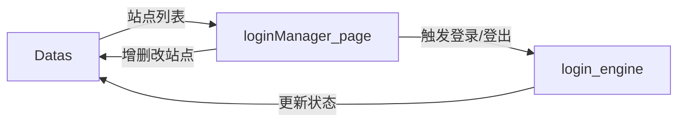

# loginManager_page — 站点管理模块

> 模块类型：页面模块  
> 对应 UI：`UI/站点管理.qml`  
> 依赖：Datas（读写）、login_engine（调用）  
> 目录：`include/loginManager_page/`、`src/loginManager_page/`

---

## 职责

管理所有已保存的 **登录站点配置**，提供 CRUD 操作、批量操作、手动触发登录/登出功能。

---

## 功能列表

### 1. 站点列表展示
- 表格/卡片视图展示所有已保存站点
- 每行显示：站点名称、类型（API / WebView）、绑定网卡、登录状态、是否启用、最后更新时间
- 状态列使用颜色区分：已登录（绿色）、未登录（灰色/红色）
- 支持按类型筛选（全部 / API / WebView）
- 支持按状态筛选（全部 / 已登录 / 未登录）
- 支持按名称搜索

### 2. 站点操作
- **新增站点**：跳转到 login_page（新建模式）创建新站点配置
- **编辑站点**：跳转到 login_page（编辑模式），加载选中站点配置进行修改
- **删除站点**：删除选中站点（需二次确认弹窗）
- **复制站点**：复制选中站点配置创建新站点（自动生成新 ID）

### 3. 批量操作
- 支持多选站点
- 批量启用 / 批量禁用
- 批量删除（需二次确认）
- 批量触发登录（调用 `login_engine.executeBatch(selectedIds)`）

### 4. 手动登录/登出
- 对单个站点点击「立即登录」按钮，调用 `login_engine.executeOne(siteId)`
- 对单个站点点击「登出」按钮，调用 `login_engine.logoutOne(siteId)`
- 登录执行期间显示 loading 状态
- 登录完成后显示结果（成功/失败 + 消息）

### 5. 状态刷新
- 「刷新全部状态」按钮：调用 login_engine 检测所有站点登录状态
- 单个站点刷新：右键菜单或操作按钮
- 显示刷新进度

---

## 数据流向

## UI 参考设计

参见 `docs/UI/站点管理.png`
