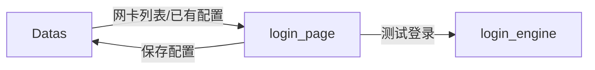

# login_page — 登录配置模块

> 模块类型：页面模块  
> 对应 UI：`UI/API_1.qml`（API 配置）、`UI/Webview_1.qml`（WebView 配置）  
> 依赖：Datas（读写）、login_engine（调用测试）  
> 目录：`include/login_page/`、`src/login_page/`

---

## 职责

提供 **登录配置的表单编辑界面**，分为 API 登录配置和 WebView 登录配置两个子视图。只负责配置的录入和保存，**不执行登录**。

---

## 功能列表

### 子视图 A：API 登录配置（UI/API_1.qml）

1. **URL 输入**：输入登录接口的完整 URL（如 `https://example.com/api/login`）
2. **请求方法选择**：下拉选择 GET / POST / PUT
3. **请求参数配置**：Key-Value 编辑器，支持动态添加/删除参数行
4. **请求头配置**（可选）：自定义 HTTP Header，Key-Value 编辑器
5. **绑定网卡选择**：下拉列表，从 Datas 获取可用网卡列表，选择指定 IP 发起请求
6. **备注**：输入站点备注名称，便于识别
7. **启用/禁用开关**：控制该站点是否参与自动登录
8. **测试登录按钮**：调用 `login_engine.testConfig(currentConfig)` 立即测试当前配置
9. **保存配置按钮**：将当前配置写入 Datas

### 子视图 B：WebView 登录配置（UI/Webview_1.qml）

1. **URL 列表管理**：添加/删除/排序需要访问的 URL 序列
2. **操作流程录制**：为每个 URL 配置 XPath 操作
   - 操作类型：click（点击）、input（输入文本）、wait（等待）
   - 数据结构：`{url: {xpath: operation}}`
   - 可视化操作列表展示
3. **绑定网卡选择**：同 API 配置
4. **备注**：同 API 配置
5. **启用/禁用开关**：同 API 配置
6. **预览/测试按钮**：调用 `login_engine.testConfig(currentConfig)` 打开 WebView 执行录制流程
7. **保存配置按钮**：写入 Datas

### 通用功能

- **新建模式**：创建新的登录配置，保存时生成唯一 ID
- **编辑模式**：从 loginManager_page 跳转，加载已有配置进行编辑
- **表单校验**：URL 格式校验、必填项校验
- **配置切换**：API / WebView 子视图切换

---

## 数据流向

## login_config 数据结构

详见 [`docs/module/Datas/模块文档.md`](../Datas/模块文档.md) 中的 login_config 部分。

## UI 参考设计

- API 配置：参见 `docs/UI/登录配置API.png`
- WebView 配置：参见 `docs/UI/登录配置-web.png`
