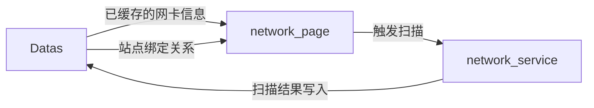

# network_page — 网卡扫描模块

> 模块类型：页面模块  
> 对应 UI：`UI/网卡扫描.qml`  
> 依赖：Datas（读）、network_service（调用）  
> 目录：`include/network_page/`、`src/network_page/`

---

## 职责

展示本机所有 **网卡信息**，提供网卡扫描和状态监控功能。

---

## 功能列表

### 1. 网卡列表展示
- 显示所有已检测到的网络接口
- 每个网卡显示以下信息：
  - 接口名称
  - IP 地址
  - 子网掩码
  - 网关
  - DNS 服务器
  - MAC 地址
  - 连接状态（已连接 ✅ / 未连接 ❌）
  - 接口类型（有线 / 无线）
- 连接状态使用颜色区分

### 2. 刷新/扫描
- 「刷新」按钮：调用 `network_service.scanNetworkCards()` 重新扫描所有网卡信息
- 支持配置自动刷新间隔（从 settings 读取）

### 3. 网卡详情
- 点击某个网卡展开详细信息面板
- 显示完整的网络配置信息
- 显示该网卡绑定的登录站点列表（从 login_config 中查询）

### 4. 绑定关系展示
- 根据 login_config 中已绑定的网卡 IP，在网卡列表中标记「被 N 个站点使用」
- 如果绑定的网卡已断开连接，显示红色警告标记

### 5. 网络状态监控
- 页面顶部显示整体网络连接状态（已连接/未连接）
- 显示主要出口 IP
- 网络断开/恢复时实时更新状态指示器

---

## 数据流向

## UI 参考设计

参见 `docs/UI/网卡扫描.png`
