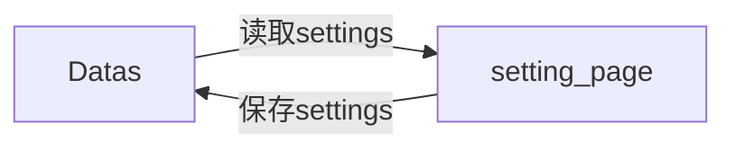

# setting_page — 系统设置模块

> 模块类型：页面模块  
> 对应 UI：`UI/系统设置页.qml`  
> 依赖：Datas（读写）  
> 目录：`include/setting_page/`、`src/setting_page/`

---

## 职责

提供应用级 **系统设置管理**，所有设置项通过 Datas 持久化存储。

---

## 功能列表

### 1. 开机自启
- 开关控件（Switch/Toggle）
- 开启时：写入系统注册表（Windows）或桌面自启目录（Linux）
- 关闭时：移除注册表项或自启文件
- 状态持久化到 Datas `settings.autoStart`

### 2. 自动登录
- 开关控件
- 开启后应用启动时自动执行所有已启用站点的登录
- `--auto-login` 命令行参数相关逻辑
- 状态持久化到 Datas `settings.autoLogin`

### 3. 最小化到托盘
- 开关控件
- 开启后关闭窗口时最小化到系统托盘而非退出
- 状态持久化到 Datas `settings.minimizeToTray`

### 4. 日志目录
- 显示当前日志存储路径
- 「选择目录」按钮：打开目录选择对话框
- 日志文件存放路径持久化到 Datas `settings.logDirectory`

### 5. 数据目录
- 显示当前数据存储路径
- 「选择目录」按钮：打开目录选择对话框
- 数据文件存放路径持久化到 Datas `settings.dataDirectory`

### 6. 主题设置
- 选项控件：浅色 / 深色 / 跟随系统
- 切换后立即生效，无需重启
- 持久化到 Datas `settings.theme`

### 7. 语言设置
- 选项控件：中文 / English
- 切换后立即生效（需配置国际化）
- 持久化到 Datas `settings.language`

### 8. 关于信息
- 应用版本号
- 作者信息
- 项目链接（只读展示）

---

## settings 数据结构

```
{
  autoStart: boolean,          // 开机自启，默认 false
  autoLogin: boolean,          // 自动登录，默认 false
  minimizeToTray: boolean,     // 最小化到托盘，默认 false
  logDirectory: string,        // 日志目录，默认 "./logs"
  dataDirectory: string,       // 数据目录，默认 "./data"
  theme: "light" | "dark",    // 主题，默认 "light"
  language: "zh" | "en"       // 语言，默认 "zh"
}
```

---

## 数据流向



## UI 参考设计

参见 `docs/UI/系统设置.png`
