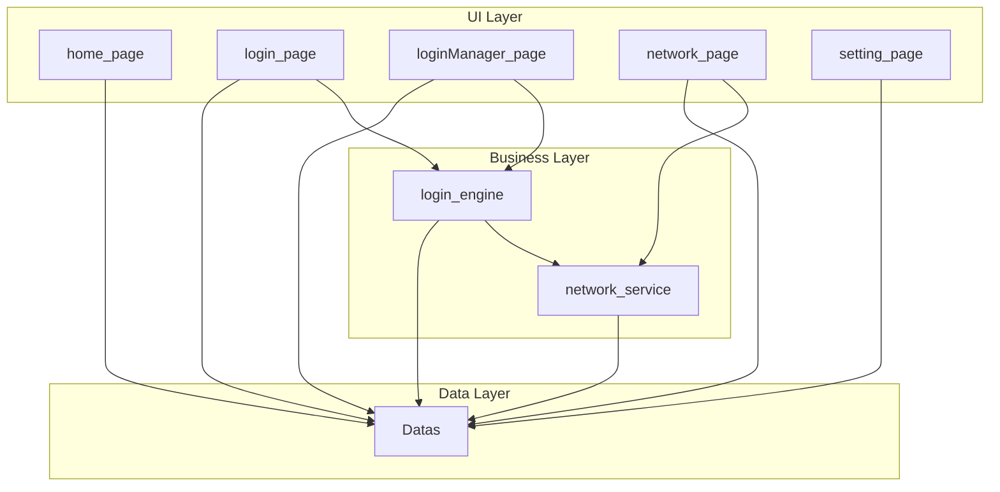
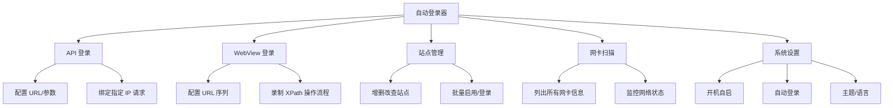
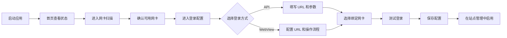
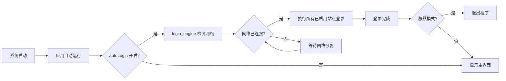

# 自动登录器 — 系统设计文档

> 最后更新：2026-06-11

## 1. 产品定位

基于 Qt/C++ 的跨平台桌面工具，支持 **API 登录** 与 **WebView 登录** 两种模式，并支持 **指定本机 IP 发起请求**，用于解决多网卡环境下的网络认证登录问题。

核心功能：
- **API 登录**：直接调用接口完成认证登录
- **WebView 登录**：记录用户操作流程，自动模拟用户操作完成登录
- **指定 IP 登录**：适配多网卡设备，控制请求从指定网卡 IP 发出
- **开机自启 + 自动登录**：系统启动后自动运行并完成登录

---

## 2. 系统架构

详见 [`docs/architecture.md`](architecture.md)

系统采用三层架构，共 8 个模块：



---

## 3. 模块清单

| 编号 | 模块 | 类型 | 职责 | 详细文档 |
|------|------|------|------|----------|
| 1 | home_page | 页面 | 仪表盘概览 | [模块文档](module/home_page/模块文档.md) |
| 2 | login_page | 页面 | 登录配置（API + WebView） | [模块文档](module/login_page/模块文档.md) |
| 3 | loginManager_page | 页面 | 站点 CRUD 管理 | [模块文档](module/loginManager_page/模块文档.md) |
| 4 | network_page | 页面 | 网卡扫描展示 | [模块文档](module/network_page/模块文档.md) |
| 5 | setting_page | 页面 | 系统设置 | [模块文档](module/setting_page/模块文档.md) |
| 6 | login_engine | 核心服务 | 登录执行引擎 | [模块文档](module/login_engine/模块文档.md) |
| 7 | network_service | 核心服务 | 网络底层服务 | [模块文档](module/network_service/模块文档.md) |
| 8 | Datas | 数据 | 数据中心 | [模块文档](module/Datas/模块文档.md) |

---

## 4. 功能结构图



---

## 5. 数据模型概览

### 5.1 登录配置（login_config）

```
API 类型：
  id, type=api, url, method, args, headers, networkCard, remark, status, enabled, updatedAt

WebView 类型：
  id, type=webview, urls[], operations{url:{xpath:op}}, networkCard, remark, status, enabled, updatedAt
```

### 5.2 网卡信息（networkCard）
```
  interfaceName, ipAddress, subnetMask, gateway, dns[], macAddress, isConnected, type
```

### 5.3 网络状态（networkStatus）
```
  isOnline, primaryIP, lastChecked
```

### 5.4 系统设置（settings）
```
  autoStart, autoLogin, minimizeToTray, logDirectory, dataDirectory, theme, language
```

详见 [`docs/module/Datas/模块文档.md`](module/Datas/模块文档.md)

---

## 6. 用户操作流程

### 6.1 首次使用流程



### 6.2 自动登录流程



---

## 7. UI 设计稿

| 页面 | 设计图 |
|------|--------|
| 首页 | `docs/UI/首页.png` |
| 登录配置 - API | `docs/UI/登录配置API.png` |
| 登录配置 - WebView | `docs/UI/登录配置-web.png` |
| 站点管理 | `docs/UI/站点管理.png` |
| 系统设置 | `docs/UI/系统设置.png` |
| 网卡扫描 | `docs/UI/网卡扫描.png` |

---

## 8. 技术栈

| 层级 | 技术 |
|------|------|
| UI | Qt 6 QML |
| 业务逻辑 | C++ (Qt Core, Qt Network) |
| WebView | Qt WebEngine |
| 数据存储 | SQLite + JSON |
| 构建系统 | CMake |
| 平台 | Windows / Linux |
