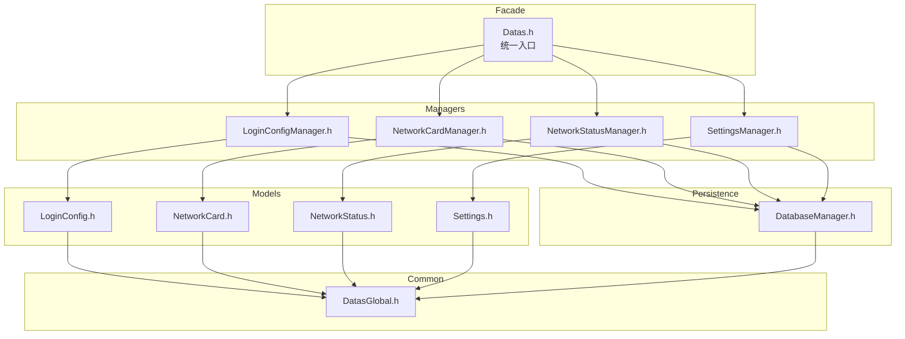

# Datas 模块 — 头文件设计方案

> 基于 [`docs/module/Datas/模块文档.md`](../docs/module/Datas/模块文档.md)

---

## 1. 设计目标

将 Datas 模块按 **职责** 拆分为多个独立头文件，实现：

- **数据模型** 与 **业务逻辑** 分离
- **不同数据实体** 独立成文件，便于维护
- **持久化层** 封装为独立模块，对上层透明
- **单一入口** `Datas.h` 对外提供统一 facade

---

## 2. 文件结构

```
include/Datas/
├── Datas.h                    # Facade 入口类，聚合所有 Manager
├── DatasGlobal.h              # 公共定义：namespace、公共 include、工具函数声明
│
├── LoginConfig.h              # 数据模型：LoginConfig 结构体
├── NetworkCard.h              # 数据模型：NetworkCard 结构体
├── NetworkStatus.h            # 数据模型：NetworkStatus 结构体
├── Settings.h                 # 数据模型：Settings 结构体
│
├── LoginConfigManager.h       # 管理器：login_config 的 CRUD + 信号通知
├── NetworkCardManager.h       # 管理器：networkCard 的 CRUD + 信号通知
├── NetworkStatusManager.h     # 管理器：networkStatus 的读写 + 信号通知
├── SettingsManager.h          # 管理器：settings 的读写 + 信号通知
│
└── DatabaseManager.h          # 持久化层：SQLite 连接管理 + JSON 文件读写

src/Datas/
├── Datas.cpp
├── LoginConfigManager.cpp
├── NetworkCardManager.cpp
├── NetworkStatusManager.cpp
├── SettingsManager.cpp
└── DatabaseManager.cpp
```

---

## 3. 模块依赖关系



---

## 4. 各文件详细设计

### 4.1 `DatasGlobal.h` — 公共定义

```cpp
#pragma once
#include <QObject>
#include <QString>
#include <QStringList>
#include <QJsonObject>
#include <QJsonArray>
#include <QDateTime>
#include <QList>
#include <QVariantMap>

namespace Datas {
// 公共类型别名、常量、工具函数声明
}
```

职责：所有 Datas 模块公共的 Qt 头文件引入、namespace 声明、公共类型别名。

---

### 4.2 `LoginConfig.h` — 登录配置数据模型

```cpp
#pragma once
#include "DatasGlobal.h"

namespace Datas {

// 登录方式枚举
enum class LoginType { Api, WebView };

// 请求方法枚举（API 类型使用）
enum class HttpMethod { Get, Post, Put };

class LoginConfig {
public:
    // === 公共字段 ===
    QString id;              // 唯一标识，自动生成
    LoginType type;          // api / webview
    QString networkCard;     // 绑定的网卡 IP
    QString remark;          // 备注名称
    QString status;          // logged_in / not_logged_in
    bool enabled;            // 是否启用自动登录
    QDateTime updatedAt;     // 最后更新时间

    // === API 类型专有字段 ===
    QString url;             // 登录接口 URL
    HttpMethod method;       // GET / POST / PUT
    QJsonObject args;        // 请求参数
    QJsonObject headers;     // 自定义请求头

    // === WebView 类型专有字段 ===
    QStringList urls;                          // URL 序列
    QMap<QString, QJsonObject> operations;     // 操作流程

    // 序列化 / 反序列化
    QJsonObject toJson() const;
    static LoginConfig fromJson(const QJsonObject& obj);
};

} // namespace Datas
```

**设计说明**：使用单一 `LoginConfig` 类 + `LoginType` 枚举区分 API / WebView，公共字段始终存在，专有字段仅在对应类型下使用。这样避免了继承带来的复杂度，且方便 `QList<LoginConfig>` 统一管理。

---

### 4.3 `NetworkCard.h` — 网卡数据模型

```cpp
#pragma once
#include "DatasGlobal.h"

namespace Datas {

class NetworkCard {
public:
    QString interfaceName;    // 接口名称
    QString ipAddress;        // IP 地址
    QString subnetMask;       // 子网掩码
    QString gateway;          // 网关
    QStringList dns;          // DNS 服务器列表
    QString macAddress;       // MAC 地址
    bool isConnected;         // 是否已连接
    QString type;             // wired / wireless

    QJsonObject toJson() const;
    static NetworkCard fromJson(const QJsonObject& obj);
};

} // namespace Datas
```

---

### 4.4 `NetworkStatus.h` — 网络状态数据模型

```cpp
#pragma once
#include "DatasGlobal.h"

namespace Datas {

class NetworkStatus {
public:
    bool isOnline;            // 整体网络连接状态
    QString primaryIP;        // 主要出口 IP
    QDateTime lastChecked;    // 最后检测时间

    QJsonObject toJson() const;
    static NetworkStatus fromJson(const QJsonObject& obj);
};

} // namespace Datas
```

---

### 4.5 `Settings.h` — 系统设置数据模型

```cpp
#pragma once
#include "DatasGlobal.h"

namespace Datas {

class Settings {
public:
    bool autoStart;           // 开机自启，默认 false
    bool autoLogin;           // 自动登录，默认 false
    bool minimizeToTray;      // 最小化到托盘，默认 false
    QString logDirectory;     // 日志目录，默认 ./logs
    QString dataDirectory;    // 数据目录，默认 ./data
    QString theme;            // 主题：light / dark，默认 light
    QString language;         // 语言：zh / en，默认 zh

    Settings();  // 构造函数中设置默认值

    QJsonObject toJson() const;
    static Settings fromJson(const QJsonObject& obj);
};

} // namespace Datas
```

---

### 4.6 `DatabaseManager.h` — 持久化层

```cpp
#pragma once
#include "DatasGlobal.h"

// 前置声明避免暴露 SQLite 头文件
struct sqlite3;

namespace Datas {

class DatabaseManager {
public:
    explicit DatabaseManager(const QString& dbPath = QString());
    ~DatabaseManager();

    bool open();
    void close();
    bool isOpen() const;

    // === 通用 SQL 操作 ===
    bool execute(const QString& sql);
    QJsonObject queryOne(const QString& sql, const QVariantMap& params = {});
    QJsonArray queryAll(const QString& sql, const QVariantMap& params = {});
    bool executeInsert(const QString& table, const QJsonObject& data);
    bool executeUpdate(const QString& table, const QString& whereClause,
                       const QJsonObject& data, const QVariantMap& whereParams = {});
    bool executeDelete(const QString& table, const QString& whereClause,
                       const QVariantMap& params = {});

    // === JSON 文件操作（用于 Settings）===
    bool saveJsonFile(const QString& filePath, const QJsonObject& data);
    QJsonObject loadJsonFile(const QString& filePath);

private:
    bool createTables();  // 初始化表结构

    sqlite3* m_db;
    QString m_dbPath;
};

} // namespace Datas
```

---

### 4.7 `LoginConfigManager.h` — 登录配置管理器

```cpp
#pragma once
#include "DatasGlobal.h"
#include "LoginConfig.h"

namespace Datas {

class DatabaseManager;  // 前置声明

class LoginConfigManager : public QObject {
    Q_OBJECT

public:
    explicit LoginConfigManager(DatabaseManager* db, QObject* parent = nullptr);

    // CRUD
    QList<LoginConfig> getList() const;
    LoginConfig get(const QString& id) const;
    bool save(const LoginConfig& config);     // 新增或更新
    bool remove(const QString& id);
    bool updateStatus(const QString& id, const QString& status);
    bool toggleEnabled(const QString& id, bool enabled);

signals:
    void loginConfigChanged(const QString& id);   // 单条变化
    void loginConfigListChanged();                 // 列表整体变化

private:
    DatabaseManager* m_db;
};

} // namespace Datas
```

---

### 4.8 `NetworkCardManager.h` — 网卡管理器

```cpp
#pragma once
#include "DatasGlobal.h"
#include "NetworkCard.h"

namespace Datas {

class DatabaseManager;

class NetworkCardManager : public QObject {
    Q_OBJECT

public:
    explicit NetworkCardManager(DatabaseManager* db, QObject* parent = nullptr);

    QList<NetworkCard> getList() const;
    bool updateList(const QList<NetworkCard>& cards);  // 全量替换

signals:
    void networkCardListChanged();

private:
    DatabaseManager* m_db;
};

} // namespace Datas
```

---

### 4.9 `NetworkStatusManager.h` — 网络状态管理器

```cpp
#pragma once
#include "DatasGlobal.h"
#include "NetworkStatus.h"

namespace Datas {

class DatabaseManager;

class NetworkStatusManager : public QObject {
    Q_OBJECT

public:
    explicit NetworkStatusManager(DatabaseManager* db, QObject* parent = nullptr);

    NetworkStatus get() const;
    bool update(const NetworkStatus& status);

signals:
    void networkStatusChanged();

private:
    DatabaseManager* m_db;
};

} // namespace Datas
```

---

### 4.10 `SettingsManager.h` — 系统设置管理器

```cpp
#pragma once
#include "DatasGlobal.h"
#include "Settings.h"

namespace Datas {

class DatabaseManager;

class SettingsManager : public QObject {
    Q_OBJECT

public:
    explicit SettingsManager(DatabaseManager* db, const QString& filePath,
                             QObject* parent = nullptr);

    Settings get() const;
    bool save(const Settings& settings);
    bool updateField(const QString& key, const QVariant& value);

signals:
    void settingsChanged();

private:
    DatabaseManager* m_db;
    QString m_filePath;
    Settings m_cache;  // 内存缓存，减少磁盘 IO
};

} // namespace Datas
```

---

### 4.11 `Datas.h` — Facade 入口

```cpp
#pragma once
#include "DatasGlobal.h"
#include "LoginConfigManager.h"
#include "NetworkCardManager.h"
#include "NetworkStatusManager.h"
#include "SettingsManager.h"

namespace Datas {

class Datas : public QObject {
    Q_OBJECT

public:
    explicit Datas(QObject* parent = nullptr);
    ~Datas();

    bool initialize(const QString& dataDir = QString());

    // 子管理器访问
    LoginConfigManager* loginConfigManager() const;
    NetworkCardManager* networkCardManager() const;
    NetworkStatusManager* networkStatusManager() const;
    SettingsManager* settingsManager() const;

    // 数据导出 / 导入
    bool exportData(const QString& filePath);
    bool importData(const QString& filePath);

private:
    DatabaseManager* m_db;
    LoginConfigManager* m_loginConfigMgr;
    NetworkCardManager* m_networkCardMgr;
    NetworkStatusManager* m_networkStatusMgr;
    SettingsManager* m_settingsMgr;
};

} // namespace Datas
```

---

## 5. 调用方式示例

```cpp
// main.cpp 或其他模块中
#include "Datas/Datas.h"

Datas::Datas datas;
datas.initialize("./data");

// 读取所有登录配置
auto configs = datas.loginConfigManager()->getList();

// 监听变化
connect(datas.loginConfigManager(), &Datas::LoginConfigManager::loginConfigChanged,
        [](const QString& id) { qDebug() << "Config changed:" << id; });

// 保存新配置
Datas::LoginConfig config;
config.type = Datas::LoginType::Api;
config.url = "http://example.com/login";
// ...
datas.loginConfigManager()->save(config);
```

---

## 6. 设计原则总结

| 原则 | 体现 |
|------|------|
| 单一职责 | 每个文件只负责一个数据实体或一个功能层 |
| 接口隔离 | 消费模块只需 include 对应的 Manager 头文件 |
| 依赖倒置 | Manager 依赖 DatabaseManager 抽象，不直接操作 SQL |
| 单向数据流 | 外部模块 → Datas facade → Manager → DatabaseManager |
| 低耦合 | Model 类是纯数据结构，不依赖 Manager；Manager 之间互不依赖 |
