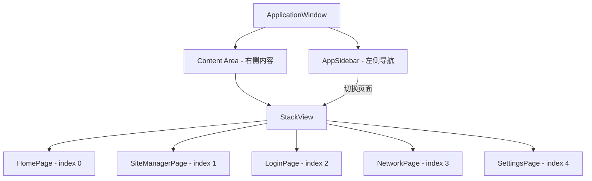

# UI 合并 + 入口程序 + CMake 修复方案

> 日期：2026-06-11  
> 状态：待实施

---

## 一、问题诊断

### 当前状态

| 文件 | 行数 | 问题 |
|------|------|------|
| `UI/首页.qml` | 2203 | Figma/Penpot 导出的纯设计稿，全是 SVG ShapePath + 静态 Text，无交互 |
| `UI/API_1.qml` | 2184 | 同上，静态设计稿 |
| `UI/Webview_1.qml` | 3008 | 同上，静态设计稿 |
| `UI/站点管理.qml` | 2184 | 同上，静态设计稿 |
| `UI/系统设置页.qml` | 2471 | 同上，静态设计稿 |
| `UI/网卡扫描.qml` | 2269 | 同上，静态设计稿 |
| `src/main.cc` | 1 | 空文件 |
| `CMakeLists.txt` | 43 | 引用不存在的 `Main.qml`，未包含 UI 文件 |

### 核心问题

1. **UI 文件是纯设计导出**：~14000 行 SVG + 绝对定位 Text，无 Button、无 TextField、无 ListView、无导航。不能直接当功能组件用
2. **没有入口程序**：`src/main.cc` 为空
3. **CMake 配置错误**：无法编译构建

---

## 二、解决方案

### 方案概述

```
保留设计稿作为参考（移入 UI/design/）
    ↓
基于设计稿的视觉风格和布局，创建新的功能性 QML 组件
    ↓
使用 StackView + 侧边栏导航实现 5 页面切换
    ↓
编写正确的 main.cc 入口和 CMakeLists.txt
```

### 2.1 QML 目录结构

```
src/qml/
├── Main.qml                    # 主窗口（ApplicationWindow + 侧边栏 + StackView）
├── components/
│   ├── AppSidebar.qml          # 侧边栏导航组件
│   └── AppHeader.qml           # 顶部标题栏组件
└── pages/
    ├── HomePage.qml            # 首页/仪表盘
    ├── LoginPage.qml           # 登录配置（含 API/WebView 两个 Tab）
    ├── SiteManagerPage.qml     # 站点管理
    ├── NetworkPage.qml         # 网卡扫描
    └── SettingsPage.qml        # 系统设置
```

原有的 `UI/*.qml` 设计稿移动到 `UI/design/` 保留作参考。

### 2.2 主窗口架构（Main.qml）



**Main.qml 结构：**
- `ApplicationWindow` 作为顶层窗口
- 左侧固定宽度 `AppSidebar`（导航菜单）
- 右侧 `StackView` 用于页面切换
- 侧边栏点击切换页面，当前页面高亮

### 2.3 侧边栏导航项

从设计稿中提取的导航结构：

| 图标 | 名称 | 目标页面 |
|------|------|----------|
| ⌂ | 首页 | HomePage |
| ▦ | 站点管理 | SiteManagerPage |
| ⟳ | 登录配置 | LoginPage |
| ▣ | 网卡扫描 | NetworkPage |
| ⚙ | 系统设置 | SettingsPage |

### 2.4 各页面功能组件

基于设计稿中提取的 UI 元素，每个页面需要以下交互控件：

**HomePage（首页/仪表盘）：**
- 状态卡片：登录状态、当前站点、登录方式、当前网卡、自启动状态
- 最近登录记录表格：时间、站点名称、登录方式、结果、耗时
- 快捷操作按钮：立即登录、打开配置、扫描网卡、刷新状态
- 提示信息栏

**LoginPage（登录配置）：**
- Tab 切换：API 登录 / WebView 登录
- API Tab：URL 输入框、请求方法选择、参数编辑器、网卡选择、测试/保存按钮
- WebView Tab：URL 列表、XPath 操作配置、网卡选择、测试/保存按钮

**SiteManagerPage（站点管理）：**
- 站点列表（ListView）
- 搜索/筛选栏
- 操作按钮：新增、编辑、删除、批量操作
- 状态指示器

**NetworkPage（网卡扫描）：**
- 网卡列表表格：名称、类型、IP、MAC、状态、默认、可用性
- 操作按钮：扫描网卡、刷新状态、设为默认
- 网卡详情面板

**SettingsPage（系统设置）：**
- 设置项列表：开机自启、自动登录、最小化到托盘（Switch 开关）
- 目录设置：日志目录、数据目录（路径显示 + 选择按钮）
- 主题/语言选择

### 2.5 设计风格

基于设计稿提取的视觉参数：

| 属性 | 值 |
|------|------|
| 窗口尺寸 | 1440 x 1024 |
| 窗口圆角 | 12px |
| 背景色 | #f7f9fc |
| 标题栏背景 | #ffffff |
| 边框色 | #d9e1ec |
| 主色调 | #1677ff（蓝色） |
| 正文色 | #172033 |
| 字体 | Inter |
| 标题字号 | 22px Bold |
| 正文字号 | 14px |

### 2.6 入口程序（src/main.cc）

```cpp
#include <QGuiApplication>
#include <QQmlApplicationEngine>

int main(int argc, char *argv[])
{
    QGuiApplication app(argc, argv);
    
    app.setOrganizationName("AutoLogin");
    app.setApplicationName("AutoLogin");
    
    QQmlApplicationEngine engine;
    engine.loadFromModule("AutoLogin", "Main");
    
    if (engine.rootObjects().isEmpty())
        return -1;
    
    return app.exec();
}
```

### 2.7 CMakeLists.txt

关键修改点：
1. 添加 `Qt6::QuickControls2` 依赖
2. 将所有 QML 文件注册到 `qt_add_qml_module`
3. 正确引用 `src/main.cc`
4. 移除不存在的 `Main.qml` 根文件引用

```cmake
cmake_minimum_required(VERSION 3.16)

project(AutoLogin VERSION 0.1 LANGUAGES CXX)

set(CMAKE_CXX_STANDARD 17)
set(CMAKE_CXX_STANDARD_REQUIRED ON)
set(CMAKE_AUTOMOC ON)
set(CMAKE_AUTORCC ON)

find_package(Qt6 6.8 REQUIRED COMPONENTS Quick QuickControls2)

qt_standard_project_setup(REQUIRES 6.8)

qt_add_executable(appAutoLogin
    src/main.cc
)

qt_add_qml_module(appAutoLogin
    URI AutoLogin
    VERSION 1.0
    QML_FILES
        src/qml/Main.qml
        src/qml/components/AppSidebar.qml
        src/qml/components/AppHeader.qml
        src/qml/pages/HomePage.qml
        src/qml/pages/LoginPage.qml
        src/qml/pages/SiteManagerPage.qml
        src/qml/pages/NetworkPage.qml
        src/qml/pages/SettingsPage.qml
)

set_target_properties(appAutoLogin PROPERTIES
    WIN32_EXECUTABLE TRUE
)

target_link_libraries(appAutoLogin
    PRIVATE Qt6::Quick Qt6::QuickControls2
)
```

---

## 三、实施步骤

### Phase 1：目录准备
1. 创建 `src/qml/`、`src/qml/components/`、`src/qml/pages/` 目录
2. 将 `UI/*.qml` 移动到 `UI/design/` 保留作参考

### Phase 2：核心框架
3. 创建 `src/qml/Main.qml` — 主窗口 + StackView 导航
4. 创建 `src/qml/components/AppSidebar.qml` — 侧边栏导航
5. 创建 `src/qml/components/AppHeader.qml` — 标题栏

### Phase 3：页面组件
6. 创建 `src/qml/pages/HomePage.qml` — 首页
7. 创建 `src/qml/pages/LoginPage.qml` — 登录配置
8. 创建 `src/qml/pages/SiteManagerPage.qml` — 站点管理
9. 创建 `src/qml/pages/NetworkPage.qml` — 网卡扫描
10. 创建 `src/qml/pages/SettingsPage.qml` — 系统设置

### Phase 4：构建配置
11. 编写 `src/main.cc` — 入口程序
12. 重写 `CMakeLists.txt` — 正确的构建配置

### Phase 5：验证
13. 编译构建验证
14. 运行验证 5 页面导航切换

---

## 四、目标文件清单

| 操作 | 文件路径 |
|------|----------|
| 新建 | `src/qml/Main.qml` |
| 新建 | `src/qml/components/AppSidebar.qml` |
| 新建 | `src/qml/components/AppHeader.qml` |
| 新建 | `src/qml/pages/HomePage.qml` |
| 新建 | `src/qml/pages/LoginPage.qml` |
| 新建 | `src/qml/pages/SiteManagerPage.qml` |
| 新建 | `src/qml/pages/NetworkPage.qml` |
| 新建 | `src/qml/pages/SettingsPage.qml` |
| 重写 | `src/main.cc` |
| 重写 | `CMakeLists.txt` |
| 移动 | `UI/*.qml` → `UI/design/*.qml` |
